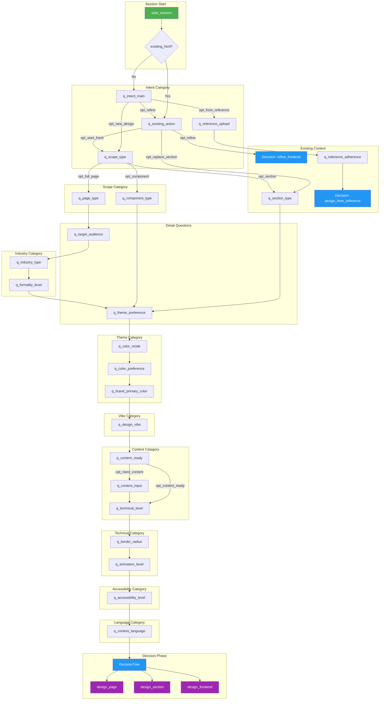
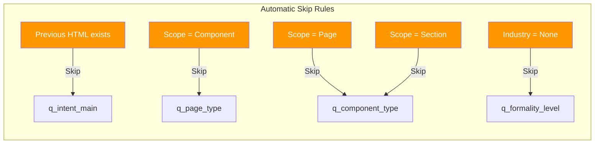
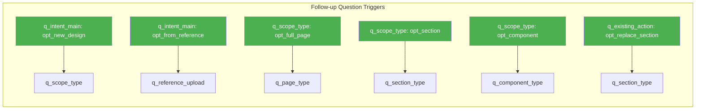
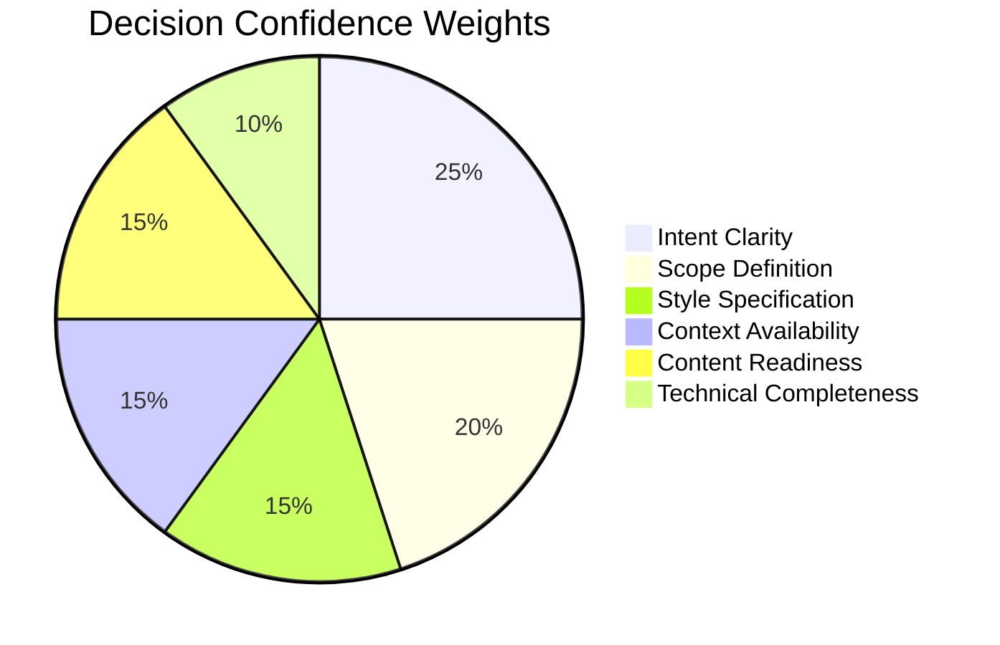
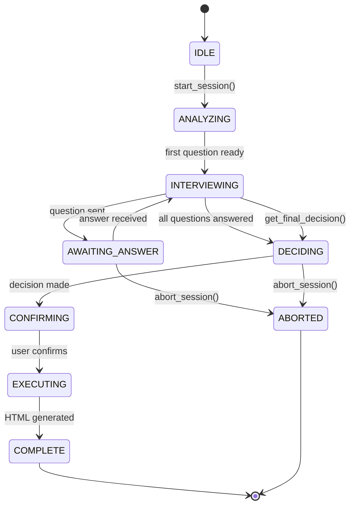

# MAESTRO Question Flow Diagram

This document visualizes the MAESTRO interview flow and decision paths.

## Main Question Flow

## Skip Rules

## Follow-Up Triggers

## Category Priority

| Priority | Category | Questions | Description |
|----------|----------|-----------|-------------|
| 1 | Intent | q_intent_main | What do you want to do? |
| 2 | Scope | q_scope_type | Page, section, or component? |
| 3 | Existing Context | q_existing_action, q_reference_* | Existing HTML context |
| 4 | Industry | q_target_audience, q_industry_type, q_formality_level | Target audience |
| 5 | Theme/Style | q_theme_preference, q_color_* | Visual style |
| 6 | Vibe/Mood | q_design_vibe | Design personality |
| 7 | Content | q_content_ready, q_content_input | Content structure |
| 8 | Technical | q_technical_level, q_border_radius, q_animation_level | Tech requirements |
| 9 | Accessibility | q_accessibility_level | WCAG level |
| 10 | Language | q_content_language | Content language |

## Decision Tree Dimensions

## Mode Selection Rules

| Condition | Mode |
|-----------|------|
| opt_from_reference + image_path | `design_from_reference` |
| opt_refine + previous_html | `refine_frontend` |
| opt_replace_section + previous_html | `replace_section_in_page` |
| opt_full_page | `design_page` |
| opt_section | `design_section` |
| opt_component (default) | `design_frontend` |

## State Machine

